# OSAGE (<ins>O</ins>bfuscated <ins>SA</ins>mple <ins>G</ins>eneration and <ins>E</ins>valuation) Framework

Compile, obfuscate, and measure C programs with different compilers and obfuscators.

## Tutorials

### Run the framework

U .c -> V compiler -> U x V .c and/or .exe/.out -> X transformer -> U x V x (X+1) .exe/.out -> Y analyzer -> U x V x (X+1) * Y .csv/.json -> aggregator -> Y .csv/.json

```plantuml
@startuml
folder src as src_dir {
    folder src_coreutils as sr_src_coreutils {
        folder ls as src_src_coreutils_ls {
            label "..." as src_coreutils_ls_label
        }
    }
    folder src_strings {
        folder anagram as src_src_strings_anagram {
            file anagram.c as anagram_c {
                label "main()..."
            }
            file anagram.metadata.assets.functions.txt {
                label "main\ncheckAnagram"
            }
            file anagram.metadata.backdoor.toml {
                label "[backdoor]\n    arguments = ['83R35whTPF83R35whTPF' '83R35whTPF83R35whTPF']\n    stdout = 'Backdoor triggered!\\n'"
            }
            file anagram.metadata.options.txt {
                label "-I. -Ilib -Isrc -c"
            }
        }
        folder src_strings_reversestring as "reversestring"{
            label "..." as src_strings_reversestring_label
        }
    }
}
folder compiler as compiler_dir {
    folder compiler_compiler {
        folder gcc_15_1_0 {
            folder build as gcc_15_1_0_build {
                file gcc_15_1_0.Dockerfile {
                    label "FROM gcc:15.1.0"
                }
                file mapper.sh as gcc_15_1_0.mapper.sh {
                    label "sample="$1"\n recipe="$2" "
                }
            }
            file config.yml as gcc_15_1_0.config.yml {
            }
            folder recipes as gcc_15_1_0_recipes {
                folder recipes_o_level as gcc_15_1_0_recipes_recipes_o_level {
                    folder o_level_0 as gcc_15_1_0_recipes_recipes_o_level_o_level_0 {
                        file o_level_o.arg {
                            label "-Wall -Wextra -O0"
                        }
                    }
                }
            }
        }
    }
}
folder analyzer as analyzer_dir {
    folder analyzer_statistics as analyzer_analyzer_statistics {
        folder out_statistics as analyzer_analyzer_statistics_out_statistics {
            folder build as analyzer_analyzer_statistics_out_statistics_build {
                file out_statistics.Dockerfile {
                    label "FROM python:3.13.5"
                }
            }
            folder recipes as analyzer_analyzer_statistics_out_statistics_recipes {
                folder out_statistics as analyzer_analyzer_statistics_out_statistics_recipes_out_statistics {
                    folder out_statistics as analyzer_analyzer_statistics_out_statistics_recipes_out_statistics_out_statistics {
                        file out_statistics.py {
                            label "#!/bin/python"
                        }
                    }
                }
            }
        }
    }
}
folder out as out_dir {
    folder run_2025_07_09_10_20_00 as run {
        folder src_strings as src_strings_out {
            folder anagram as anagram_dir_out {
                folder "gcc_15_1_0-o_level_0" as out_run_src_strings_anagram_gcc_O0 {
                    file anagram.out as anagram_out {
                        label "101101010110"
                    }
                    file anagram.log as anagram_log {
                        label "log..."
                    }
                    folder out_statistics as out_run_src_strings_anagram_gcc_O0_out_statistics {
                        file anagram.out_statistics.csv {
                            label "executable_exists,executable_permissions_x,...\n True,True,..."
                        }
                    }
                }
            }
        }
    }
}
node Osagecontainer001 as container001 {
    label "compilation container"
}
node Osagecontainer002 as container002 {
    label "analysis container"
}
' Compilation
anagram_c -[#blue]-> container001
gcc_15_1_0_recipes_recipes_o_level_o_level_0 -[#blue]-> container001
container001 -[#blue]-> anagram_out
container001 -[#blue]-> anagram_log

' analysis
src_src_strings_anagram -[#red]-> container002
out_run_src_strings_anagram_gcc_O0 -[#red]-> container002
container002 -[#red]-> out_run_src_strings_anagram_gcc_O0_out_statistics
analyzer_analyzer_statistics_out_statistics_recipes_out_statistics_out_statistics -[#red]-> container002

' FORCE Positioning of the folders
' src_dir -[hidden]d- compiler_dir
' compiler_dir -[hidden]d- out_dir
@enduml
```



The basic workflow consists of the following commands:

```ShellSession
# Build the docker containers for the enabled compilers/obfuscators, analyzer,...
$ python osage.py build
# Compile all enabled sources with all enabled compilers/obfuscators
$ python osage.py compile
# Analyze all samples (from the latest run directory in the out directory) with all enabled analyzers
$ python osage.py analyze
# Aggregate the individual results of the analyzers into a single file
$ python osage.py aggregate
```

There are also some advanced comands (which are useful if you e.g. add a new compiler):
```ShellSession
# Delete the enabled docker containers and rebuild them
$ python osage.py rebuild
```

### Add a compiler/obfuscator
TODO: Add tutorial

### Add a analyzer
TODO: Add tutorial

### Add a sample/src
TODO: Add tutorial


## Roadmap

- [] Make testcases and backdoors for all samples.
- [] Add a similarity hash analyzer to check how different the samples are to each other.
- [] Check why for tinyCC sometimes it crashes randomly and throws this error: docker.errors.NotFound: 404 Client Error for http+docker://localhost/v1.51/containers/825177cf6d1ffc71ea38d7be845b6576dbd6f2b13f5c5a6da10e479fa3e9e491/json: Not Found ("No such container: 825177cf6d1ffc71ea38d7be845b6576dbd6f2b13f5c5a6da10e479fa3e9e491")
- [] Rethink the fallback for tigress, on July 12th 2025 9:05 the Tigress download website was down: Website Name: tigress.cs.arizona.eduURL Checked: no responseResponse Time: unknownLast Down: DOWN Tigress.cs.arizona.edu is DOWN It is not just you. The server is not responding...
- [] Check the usage of frama-c, since it is not a compiler nor an obfuscator, it is a source-code analysis tool. Also it does not include o-levels?
- [] Github Actions (Pipeline)
  - [] Automatically check the structure for merge requests
  - [] Build and push Docker containers
- [] Add a warning for Windows users to start Docker Desktop first, or use WSL2
- [] Maybe replace python docker package with aiodocker?
- [x] Check why the compiled programs of src_strings/anagram give a Segmentation Fault -> Sample source did not check for 2 arguments, fixed now


## History

2025-07 Restructuring of the code (cooki35, felpower).
2024 Rebranding to OSAGE and continuation of the development for the CDL ASTRA. (felpower)
2021 Master thesis of is191840 adding some measurement code
2020 Idea and development of Obfuscation ABCDEF (<ins>A</ins>utomatic <ins>B</ins>enchmark, <ins>C</ins>ompilation and <ins>D</ins>ynamic <ins>E</ins>valuation <ins>F</ins>ramework) for the EMRESS FWF project. (cooki35)


## Contributors

- cooki35
- dschm1dt
- felpower
- is191840
- sschritt
