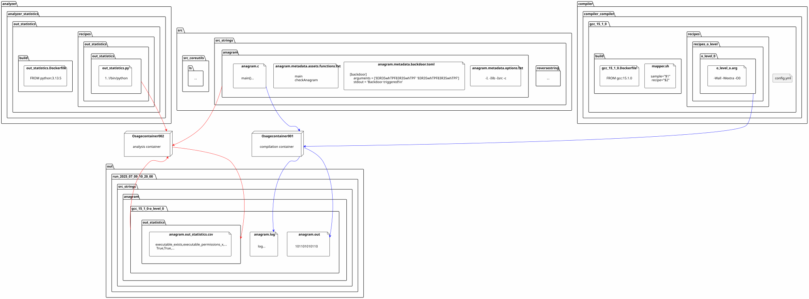

# OSAGE (O̲bfuscated S̲A̲mple G̲eneration and E̲valuation) Framework

Compile, obfuscate, and measure C programs with different compilers and obfuscators.

Each compiler, transformer and analyzer component has its own Dockercontainer.

- Run multiple compilers at once and one compiler multiple times without them influencing each other.
- No need to manually install each tool on the host.
- No need to update all images if we want to update a single tool.

Features:

- Directories are configurable, allowing you to work on multiple projects by simply changing the directory. E.g., if for one project we need to work with gcc and tigress we just copy the ```./compiler``` directory to ```./compiler_project001``` and change the ```[compiler] directory = "compiler_project001"``` configuration in ```./config.toml```.
- Timeouts. Even if one analysis or compilation hangs it will timeout.
- Logging. All warnings and errors from within the docker container are stored in .log files.

## Run the framework

The basic workflow consists of the following commands:

```ShellSession
# Build the docker containers for the enabled compilers/obfuscators, analyzer,...
python osage.py build
# Compile all enabled sources with all enabled compilers/obfuscators
python osage.py compile
# Analyze all samples (from the latest run directory in the out directory) with all enabled analyzers
python osage.py analyze
# Aggregate the individual results of the analyzers into a single file
python osage.py aggregate
```

There are also some advanced comands (which are useful if you e.g. add a new compiler):

```ShellSession
# Delete the enabled docker containers and rebuild them
python osage.py rebuild
```

If you want to check out a docker container use the following:

```ShellSession
docker run --rm -it --entrypoint /bin/bash tendra:latest
```

## Overview

The following is an overview, which and how many files are generated by which component.
The values U, V, X, Y depend on how many of these elements are enabled (e.g., U = number of src enabled).

U .c &#8594; V compiler &#8594; U x V .c and/or .exe/.out &#8594; X transformer &#8594; U x V x (X+1) .exe/.out &#8594; Y analyzer &#8594; U x V x (X+1) * Y .csv/.json &#8594; aggregator &#8594; Y .csv/.json



To generate the overview graph above use plantuml:

```ShellSession
# Generate overview figure
plantuml -svg framework_overview.puml
```

## Src (Sources)

C Sample Sources are by default located in the src directory.
Sources, compilers, transformers analyzers, and recipes starting with underscore (```_```) are ignored.
Like compilers (```./compiler```), analyzers (```./analyzer```), and transformers (```./transformer```), the sources (```./src```) are organized in groups e.g., ```src/src_strings```.
To enable samples put e.g., a group ```src_strings``` or sample ```src_strings/reversestring``` into the file ```src/enabled.src.yaml```.

Each sample consists of the following files:

- ```samplename/samplename.c``` &#8594; Source code of the sample. Should have a main function and some kind of backdoor(s) (a specified input that triggers e.g., a message like "Backdoor triggered\n" on stdout).
- ```samplename/samplename.metadata.assets.functions.txt``` &#8594; List of functions (1 per line) the sample considers to be assets worth protecting.
- ```samplename/samplename.metadata.backdoors.toml``` &#8594; TOML file with backdoor(s) infos e.g., arguments to pass to the sample to trigger the backdoor, or stdout text to check if the backdoor was triggered.
- ```samplename/samplename.metadata.options.txt``` &#8594; Compiler/Linker options to pass to the compiler/linker/obfuscator specific to the sample (e.g., -lm for math).
- ```samplename/samplename.metadata.testcases.toml``` &#8594; TOML file with testcase(s) infos e.g., arguments/stdin to pass to the sample, as well as stdout and exit code to expect with this input.

## Compiler (Compiler and Obfuscators)

Compilers and obfuscators are by default located in the ```./compiler``` directory.
Sources, compilers, transformers analyzers, and recipes starting with underscore (```_```) are ignored.
Like sources (```./src```), analyzers (```./analyzer```), and transformers (```./transformer```), the compilers (```./compiler```) are organized in groups e.g., ```compiler/compiler_obfuscator```.
A single compiler can have multiple recipes.
A recipe makes the compiler behave differently, e.g., enabling or disabling optimizations of a compiler or for obfuscators changing which obfuscation methods are used.

Each compiler consists of the following files:

- ```compilername/build/compilername.Dockerfile``` &#8594; Dockerfile to build the docker container.
- ```compilername/recipes/enabled.recipes.yaml``` &#8594; Which recipes to run.
- ```compilername/recipes/recipegroup/recipe001/recipe001.arg``` &#8594; Arguments to pass to the Dockercontainer to enable that recipe.

Note: Compilers may declare required input files using `mandatory_files` (string or list of glob patterns) in `build/config.yaml`. The framework checks these patterns against the sample source directory (the directory mounted as `/in`) on the host and will skip scheduling the compiler container if no matches are found.

## Transformer (Transformers)

Transformers work on a binary level and transform an existing sample binary into a new binary. E.g., Packing.
Transformers work on a binary level and transform an existing sample binary into a new binary, for example packers or binary-level rewriters. They typically take an input binary (the compiled sample) and produce one or more transformed binaries that are treated like additional variants in the pipeline.

A transformer should:

- Accept a path to an input binary or a sample run directory.
- Produce one or more transformed binaries written to the configured output directory.
- Preserve expected exit codes or provide clear failure reporting so downstream analyzers can handle errors.

Start from the `transformer/template_` folder to ensure your transformer follows the framework conventions.

## Analyzer (Analyzers and Converters)

Analyzers and converters are by default located in the ```./analyzer``` directory.
Sources, compilers, transformers analyzers, and recipes starting with underscore (```_```) are ignored.
Like sources (```./src```), compilers (```./compiler```), and transformers (```./transformer```), the analyzers (```./analyzer```) are organized in groups e.g., ```analyzer/analyzer_testing```.
A single analyzer can have multiple recipes.
A recipe makes the analyzer behave differently, e.g., check if the backdoor functionality still works, or check if the testcases still produce the same output.

Each analyzer consists of the following files:

- ```analyzername/build/analyzername.Dockerfile``` &#8594; Dockerfile to build the docker container.
- ```analyzername/recipes/enabled.recipes.yaml``` &#8594; Which recipes to run.
- ```analyzername/recipes/recipegroup/recipe001/recipe001.py``` &#8594; File to run inside the Dockercontainer. This file does the actual analysis.

Note: Analyzers may declare required output files using `mandatory_files` (string or list of glob patterns) in `build/config.yaml`. The framework checks these patterns against the per-sample output directory (the directory mounted as `/out`) on the host and will skip scheduling the analyzer container if no matches are found.

## Tutorials

### Add a compiler/obfuscator

1. Create a new compiler directory under `./compiler`.
   - Recommended layout:

```text
compiler/
  <group_name>/<compiler_name>/
    build/<compiler_name>.Dockerfile
    recipes/enabled.recipes.yaml
    recipes/<recipe_group>/recipe001/recipe001.arg
```

1. Dockerfile: install the compiler/obfuscator and provide an entrypoint that performs the compile/transform step. Keep it small and reproducible. Start from the repository-provided `template_` folders (copy `compiler/template_` into a new `<group_name>/<compiler_name>` and adapt) instead of cloning a production compiler — these templates already follow the framework conventions.

Example `recipes/enabled.recipes.yaml`:

```yaml
enabled:
  - basic/recipe001
```

Example `recipe001.arg` (one-line, freeform arguments or flags your entrypoint expects):

```text
-O2 -std=c11 -lm
```

1. Enable the new compiler by adding its path to `compiler/enabled.compiler.yaml` (the list under `enabled:`), using the same group/name form, e.g. `compiler_obfuscator/mycompiler`.

2. Rebuild and run:

```ShellSession
python osage.py rebuild    # builds the new container(s)
python osage.py compile    # runs compilation with enabled compilers/recipes
```

Notes:

- Use the provided `template_` folders as the canonical templates — they follow the framework layout and entrypoint conventions.
- Files/Folders starting with an underscore (`_`) are ignored by the framework.

### Add an analyzer

1. Create a new analyzer directory under `./analyzer`.
   - Recommended layout:

```text
analyzer/
  <group_name>/<analyzer_name>/
    build/<analyzer_name>.Dockerfile
    recipes/enabled.recipes.yaml
    recipes/<recipe_group>/recipe001/recipe001.py
```

1. The analyzer recipe is a program (Python is common) that is executed inside the analyzer container. It should accept the path to the binary or the sample run directory and write its results into the configured output directory (CSV or JSON). Keep outputs per-sample and use a consistent filename (e.g. `<sample>.json` or `<sample>.csv`). Start from the `analyzer/template_` folder as your first step — the template shows how inputs are mounted and where outputs should be placed.

Minimal example `recipe001.py`:

```python
#!/usr/bin/env python3
import sys, json, pathlib

# simple example: receives a path to a binary
binary = sys.argv[1]
result = {"binary": binary, "metrics": {"size": pathlib.Path(binary).stat().st_size}}
out = pathlib.Path("/out") / (pathlib.Path(binary).stem + ".json")
out.write_text(json.dumps(result))
```

1. Enable the analyzer by adding its path to `analyzer/enabled.analyzer.yaml` under `enabled:`.

2. Run analysis:

```ShellSession
python osage.py analyze
python osage.py aggregate   # aggregate analyzer outputs if desired
```

Notes:

- Use the provided `template_` analyzer folders as the canonical starting point.
- Recipe scripts should be executable and self-contained inside the container.

### Add a transformer

1. Create a new transformer directory under `./transformer`.
   - Recommended layout:

```text
transformer/
  <group_name>/<transformer_name>/
    build/<transformer_name>.Dockerfile
    recipes/enabled.recipes.yaml
    recipes/<recipe_group>/recipe001/recipe001.arg
```

1. Transformers operate on compiled binaries. The container entrypoint or recipe should accept an input binary path and write the transformed binary to the expected output location (e.g. `/out/<sample>_transformed`).

2. Use the repository `transformer/template_` folder as the canonical starting point — it includes mounting conventions and example entrypoints.

3. Enable the transformer by adding its path to `transformer/enabled.transformer.yaml` under `enabled:`.

4. Run the workflow that includes transformation (usually part of the compile step) and then analysis:

```ShellSession
python osage.py rebuild    # if you added/changed containers
python osage.py compile    # compiles and runs transformers
python osage.py analyze
```

Notes:

- Transformers must be careful with symbol names if they create or remove functions — use metadata patterns (assets) or regex conventions to keep asset detection working.
- Keep transformers idempotent where possible: producing repeatable outputs simplifies debugging and aggregation.

### Add a sample/src

1. Add a new sample group or sample directory under `./src`.
   - Typical layout for a single sample `mysample` inside group `src_examples`:

```text
src/
  src_examples/
    mysample/
      mysample.c
      mysample.metadata.assets.functions.txt
      mysample.metadata.backdoors.toml
      mysample.metadata.options.txt
      mysample.metadata.testcases.toml
```

1. Minimal metadata examples:

`mysample.metadata.assets.functions.txt` (one function name per line):

```text
main
helper
```

`mysample.metadata.backdoors.toml`:

```toml
[[backdoors]]
args = ["secret"]
stdout_contains = "Backdoor triggered"
```

`mysample.metadata.options.txt` (compiler/linker options, one line):

```text
-lm
```

`mysample.metadata.testcases.toml`:

```toml
[[testcases]]
args = ["hello"]
stdin = ""
stdout_contains = "hello"
exit_code = 0
```

1. Enable the sample group in `src/enabled.src.yaml` by adding the group name under the `enabled:` list (e.g. `src_examples`).

2. Run the normal workflow to compile and analyze the new samples:

```ShellSession
python osage.py compile
python osage.py analyze
```

Notes:

- Samples and groups that start with an underscore (`_`) are ignored.
- Creating metadata for testcases and backdoors is important so analyzers can verify behavior after transformations.
- There is a helper script `src/create_asset_files.py` that can auto-generate the basic metadata files for a sample group. Edit the `parent_dir` variable at the top of the script to point to your sample group (e.g. `src_examples` or `src_coreutils_wildcard`) and then run:

```ShellSession
python src/create_asset_files.py
```

The script will generate `*.metadata.*` files (assets, backdoor, options, testcases) inside each sample subdirectory; review and update them to match your sample specifics.

## Frequenly Asked Questions (FAQ)

### Permissions

```txt cannot create directory \'...\': Permission denied```.
Change the permissions of the ```out``` folder or change the settings ```[containers] user_mapping = "1000:1000"``` in the config.toml.

## Roadmap

- [ ] Make testcases and backdoors for all samples.
- [ ] Add cproc compiler: <https://sr.ht/~mcf/cproc/>
- [ ] Add scc compiler: <https://www.simple-cc.org/>
- [ ] Add a similarity hash analyzer to check how different the samples are to each other. Maybe look at: <https://github.com/trendmicro/tlsh>
- [ ] Check why for tinyCC sometimes it crashes randomly and throws this error: docker.errors.NotFound: 404 Client Error for http+docker://localhost/v1.51/containers/825177cf6d1ffc71ea38d7be845b6576dbd6f2b13f5c5a6da10e479fa3e9e491/json: Not Found ("No such container: 825177cf6d1ffc71ea38d7be845b6576dbd6f2b13f5c5a6da10e479fa3e9e491")
- [ ] Rethink the fallback for tigress, on July 12th 2025 9:05 the Tigress download website was down: Website Name: tigress.cs.arizona.eduURL Checked: no responseResponse Time: unknownLast Down: DOWN Tigress.cs.arizona.edu is DOWN It is not just you. The server is not responding...
- [ ] Github Actions (Pipeline)
  - [ ] Automatically check the structure for merge requests
  - [ ] Build and push Docker containers
- [ ] Add a warning for Windows users to start Docker Desktop first, or use WSL2
- [ ] Maybe replace python docker package with aiodocker?
- [ ] Add merge recipes with exclude main function
  - [ ] Find a way for smaller samples with <=2 functions to not throw errors when excluding main function with merge transformation
- [X] Add regex for functions (/.*function.*/) in order to target all derived function created from previous tigress transformations -> Added src_coreutils_wirdcard with wildcard functions for all sources
- [X] Check why the compiled programs of src_strings/anagram give a Segmentation Fault -> Sample source did not check for 2 arguments, fixed now

## History

- 2025-07 Restructuring of the code (cooki35, felpower).
- 2024 Rebranding to OSAGE and continuation of the development for the CDL ASTRA. (felpower)
- 2021 Master thesis of is191840 adding some measurement code
- 2020 Idea and development of Obfuscation ABCDEF (A̲utomatic B̲enchmark, C̲ompilation and D̲ynamic E̲valuation F̲ramework) for the EMRESS FWF project. (cooki35)

## Related Work

- Pangine Ground Truth Benchmark: <https://doi.org/10.1145/3411502.3418429> <https://github.com/pangine/disasm-benchmark>
- TUM Obfuscation Benchmark: <https://github.com/tum-i4/obfuscation-benchmarks>

## Contributors

- cooki35
- dschm1dt
- felpower
- is191840
- sschritt
 
